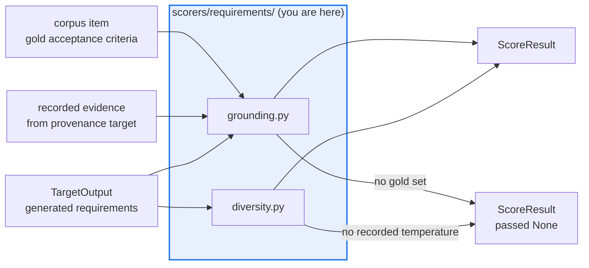

# AGENTS.md — src/eval_harness/scorers/requirements

> Four scorers over a generated requirement set. The gold set comes from the corpus, never the output.

These grade a generated requirement set against the epic's declared acceptance criteria and
the retrieval evidence a provenance-recording target actually captured. No judge, no numpy.

## Map

| Path | Role |
|---|---|
| `__init__.py` | Shared readers (`read_requirements`, `not_applicable`), the comment constants, and the evidence lookup keyed by `REQUIREMENTS_EVIDENCE_KEY` |
| `grounding.py` | `req_ac_recall`, `req_scope_hallucination`, `req_traceability_closure` |
| `diversity.py` | `req_semantic_diversity` — lexical by design; an embedding variant belongs behind an optional extra, not here |

## Diagram



## Rules that bite here

- **Protected path.** `src/eval_harness/scorers/**` is in `scripts/eval_protected_paths.py`,
  so a pull request touching this directory needs the `eval-change-approved` label.
- **Never infer the gold set from the artifact being graded.** That is circular — the target
  would be defining its own target. The corpus item carries it, and its absence is
  `passed=None`, not a pass.
- **Read the recorded evidence, not the generator's account of it.** The checks consume the
  payload the provenance wrapper attached under `REQUIREMENTS_EVIDENCE_KEY`; a generator's
  self-reported source list is not evidence.
- **Keep the diversity measure lexical.** Embeddings would add a runtime dependency to a
  package whose suite installs with none, and make the score vary under `repetitions > 1`.
- **A malformed requirement set and an empty one are different outcomes.** `read_requirements`
  returns `None` for the first and an empty list for the second; do not merge the branches.

## Verify

```bash
python -m pytest tests/test_requirements_scorers.py tests/test_matrix_requirements_scorers.py -q
```

## Subagents

| Task in this directory | Agent | Why |
|---|---|---|
| Trace which evidence keys a scorer reads before changing the payload | `explorer` | The producer is one target module; a `Grep` for the evidence key spans both sides |
| Run the requirements suites and the corpus regeneration check | `test-runner` | Has `Bash`; the corpus check fails on byte drift, which needs a real run |
| Review a recall or hallucination change before requesting the label | `narrow-critic` | Reads the finished diff for a measure quietly made easier to pass |

## See also

| Doc | Read it when |
|---|---|
| [`../../../../docs/decisions/0047-requirements-eval-matrix.md`](../../../../docs/decisions/0047-requirements-eval-matrix.md) | You are adding a measure and need why grounding and diversity are separated |
| [`../../targets/provenance.py`](../../targets/provenance.py) | You need the producer of the evidence payload these scorers read |
| [`../../../../config/requirements_eval.yaml`](../../../../config/requirements_eval.yaml) | You want the live wiring: corpus, scorers and the advisory gate thresholds |
| [`../AGENTS.md`](../AGENTS.md) | You need the package-wide scorer contract rather than this matrix's |
