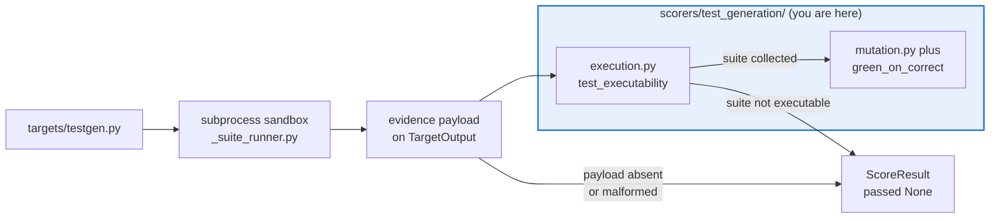

# AGENTS.md — src/eval_harness/scorers/test_generation

> Four pure readers of suite-execution evidence. The target executes; nothing here does.

Every scorer in this directory is a pure function of the payload `targets/testgen.py`
publishes after running a generated suite in a subprocess sandbox. No process execution, no
filesystem mutation, no network — that seam is the whole reason the directory exists.

## Map

| Path | Role |
|---|---|
| `__init__.py` | Payload readers, the `NO_EVIDENCE` / `NOT_EXECUTABLE` / `MALFORMED_EVIDENCE` comment constants, and the bottom-of-file imports that run the registrations |
| `execution.py` | `test_executability`, `testgen_green_on_correct` |
| `mutation.py` | `testgen_mutation_score`, `requirement_obligation_recall` |

## Diagram



## Rules that bite here

- **Protected path.** `src/eval_harness/scorers/**` is in `scripts/eval_protected_paths.py`,
  so a pull request touching this directory needs the `eval-change-approved` label.
- **Do not move execution into a scorer.** Purity here is what keeps `repetitions > 1`
  measuring the target's variance, keeps these scorers running in the offline suite
  unchanged, and keeps a backend swap confined to one target instead of four scorers.
- **Executability gates the other three.** A mutation score over a suite that never ran is
  not a low score, it is a meaningless one, so report not-applicable instead of a number.
- **Three absent-evidence cases stay distinct.** `NO_EVIDENCE` (nothing ran), `NOT_EXECUTABLE`
  (a real suite that did not collect) and `MALFORMED_EVIDENCE` (a bug in the producer) have
  separate constants on purpose; a soak has to tell them apart from a results file.
- **Registrations run from the bottom of `__init__.py`.** The sibling modules are imported
  there for the decorator side effect; removing that import silently unregisters the scorers.

## Verify

```bash
python -m pytest tests/test_matrix_testgen_scorers.py tests/test_testgen_target.py -q
```

## Subagents

| Task in this directory | Agent | Why |
|---|---|---|
| Map every payload field a scorer reads before changing the producer | `explorer` | Producer and readers sit in two packages; a `Grep` for the evidence key covers both |
| Run the testgen matrix rows and the target suite together | `test-runner` | Has `Bash`; the sandbox path only fails under a real subprocess run |
| Review a change that touches the payload contract | `narrow-critic` | A silently widened reader turns a missing field into a passing score |

## See also

| Doc | Read it when |
|---|---|
| [`../../../../docs/decisions/0043-testgen-evaluation-seam.md`](../../../../docs/decisions/0043-testgen-evaluation-seam.md) | You are tempted to execute something here and need why the seam is drawn at the target |
| [`../../../../docs/decisions/0045-testgen-sandbox-boundary.md`](../../../../docs/decisions/0045-testgen-sandbox-boundary.md) | You are changing what the sandbox reports, which is what these scorers read |
| [`../../targets/testgen.py`](../../targets/testgen.py) | You need the producer of the payload, including the exact shape each scorer expects |
| [`../AGENTS.md`](../AGENTS.md) | You need the package-wide scorer contract rather than this matrix's |
