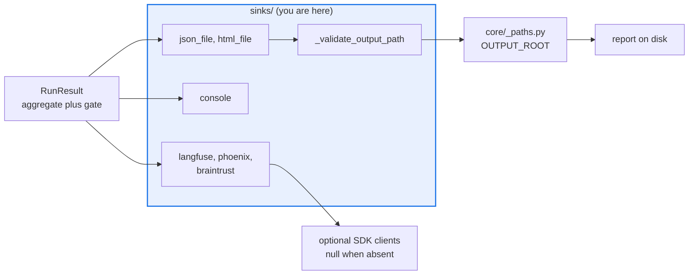

# AGENTS.md — src/eval_harness/sinks

> The only write path out of a run. Every file write here is confined by `OUTPUT_ROOT`.

A sink takes a finished `RunResult` and emits it — to a terminal, to a file, or to a vendor.
It reports; it never decides. The gate verdict is already attached by the time `emit` is
called, and a sink that recomputed one would be a second source of truth.

## Map

| Path | Role |
|---|---|
| `__init__.py` | The whole package: six registered sinks plus `_validate_output_path` |
| `ConsoleSink` | `console` — human-readable summary on stdout |
| `JsonFileSink`, `HtmlFileSink` | `json_file` / `html_file` (aliases `json` / `html`) — the confined file writers |
| `LangfuseSink`, `PhoenixSink`, `BrainTrustSink` | `langfuse` / `phoenix` / `braintrust` — vendor export through the SDK-optional client seams |

## Diagram



## Rules that bite here

- **Every config-supplied output path goes through `_validate_output_path`.** These sinks create directories and overwrite files, so an unvalidated path lets a run write anywhere the process
  can. `OUTPUT_ROOT` is deliberately a *different* variable from the dataset read root, so naming a read-only corpus as `DATA_ROOT` never makes it a legal write target.
- **Warn once per sink, in the constructor.** With `OUTPUT_ROOT` unset the write stays unconfined and logs a single warning at construction, not one per `emit`.
- **A sink reads the gate verdict, it does not compute one.** `RunResult.gate` is attached by the engine before the sinks run (F-062) so that every exported artifact carries the same
  verdict; deriving pass or fail locally would let two artifacts disagree.
- **Vendor export degrades to a no-op.** If the SDK is absent or the network is unreachable, the run must still finish — telemetry is never allowed to fail an evaluation.
- **Nothing imports this package by name**, and a new sink's registered name must appear in the README tables or `python scripts/extract_registries.py --check` reports drift. At 396 lines
  this file is close to the 500-line ceiling, so a seventh sink belongs in a sibling module imported for its registration side effect.

## Verify

```bash
python -m pytest tests/test_components.py tests/test_html_sink.py tests/test_path_confinement.py -q
```

## Subagents

| Task in this directory | Agent | Why |
|---|---|---|
| Find every path that reaches a file write before adding a sink | `explorer` | Read-only `Grep` for the confinement helper shows whether a new writer is covered |
| Run the sink and path-confinement suites after a write-path change | `test-runner` | Has `Bash`; confinement is only provable by actually resolving paths |
| Review a new vendor sink for a credential or a hard failure mode | `narrow-critic` | Reads the finished diff for a telemetry error that can abort a run |

## See also

| Doc | Read it when |
|---|---|
| [`../core/_paths.py`](../core/_paths.py) | You are adding a writer and need the containment rule and why it resolves rather than compares text |
| [`../../../docs/decisions/0042-gate-decision-provenance.md`](../../../docs/decisions/0042-gate-decision-provenance.md) | You are changing what an exported artifact carries about the gate |
| [`../../../docs/braintrust-spike.md`](../../../docs/braintrust-spike.md) | You are wiring a new vendor export and want the reversible-adoption pattern to copy |
| [`../AGENTS.md`](../AGENTS.md) | You need the harness-wide contract rather than this directory's |
