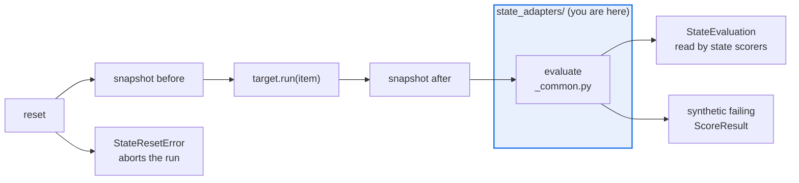

# AGENTS.md — src/eval_harness/state_adapters

> Four local, deterministic world-state adapters. The engine owns the lifecycle; these only answer.

An adapter resets a small world, snapshots it before and after `target.run(item)`, and
judges the difference. Everything that ships here is offline and deterministic — no
credentials, no network, no domain adapters — so the zero-dependency suite keeps holding.

## Map

| Path | Role |
|---|---|
| `__init__.py` | All four registered adapters |
| `InMemoryStateAdapter` | `in_memory` — the reference adapter: a mutable mapping, no I/O |
| `FilesystemStateAdapter` | `filesystem` — a temporary sandbox directory; snapshots hash file bytes |
| `SqliteStateAdapter` | `sqlite` — a transaction over a temporary database |
| `MockHttpStateAdapter` | `mock_http` — in-process request recording, no sockets |
| `_common.py` | The shared `evaluate()` body for adapters whose snapshot is a flat mapping |

## Diagram



## Rules that bite here

- **The lifecycle lives in `core/_state_lifecycle.py`, not here.** The whole sequence runs under one lock spanning `target.run()` as well, because a shared adapter instance is not safe with
  more than one worker. Adding concurrency inside an adapter does not buy back the parallelism that lock costs; it just moves the race.
- **A reset failure must propagate.** `StateResetError` is raised uncaught and aborts the run regardless of `fail_fast` — continuing would score against dirty state. A snapshot or evaluate
  failure is wrapped instead and surfaces as a visibly failed score, never a drop.
- **An adapter observes only what it is told.** It does not intercept or instrument the target; whatever mutates the world during the attempt calls the adapter directly.
- **Per-item expectations are metadata conventions, not new fields.** `state_expectation` and `state_forbidden_keys` are read from `item.metadata`. A forbidden-key violation is independent
  of goal attainment: an attempt can reach its goal *through* a forbidden mutation.
- **Keep every adapter local and deterministic.** A production credential or a real network call here breaks the offline suite's central property, and belongs behind the same `StateAdapter`
  Protocol in a separate package instead.

## Verify

```bash
python -m pytest tests/test_state_adapter_contracts.py tests/test_state_lifecycle.py tests/test_matrix_state_adapters.py -q
```

## Subagents

| Task in this directory | Agent | Why |
|---|---|---|
| Find which metadata keys the adapters and scorers agree on | `explorer` | The convention spans this package and the state scorers; read-only `Grep` spans both |
| Run the contract, lifecycle and matrix suites after an adapter change | `test-runner` | Has `Bash`; the lock and the abort semantics only show under a real run |
| Review a new adapter for hidden I/O or nondeterminism | `narrow-critic` | A clock or a socket inside an adapter is what breaks the offline guarantee |

## See also

| Doc | Read it when |
|---|---|
| [`../core/_state_lifecycle.py`](../core/_state_lifecycle.py) | You are changing when reset, snapshot or evaluate is called, or how a failure is classified |
| [`../scorers/state.py`](../scorers/state.py) | You need the consumers of `StateEvaluation` before changing what an adapter reports |
| [`../../../docs/decisions/0031-additive-core-model-extension-for-agent-evaluation.md`](../../../docs/decisions/0031-additive-core-model-extension-for-agent-evaluation.md) | You want to add a field to the core model rather than a metadata convention |
| [`../AGENTS.md`](../AGENTS.md) | You need the harness-wide contract rather than this directory's |
