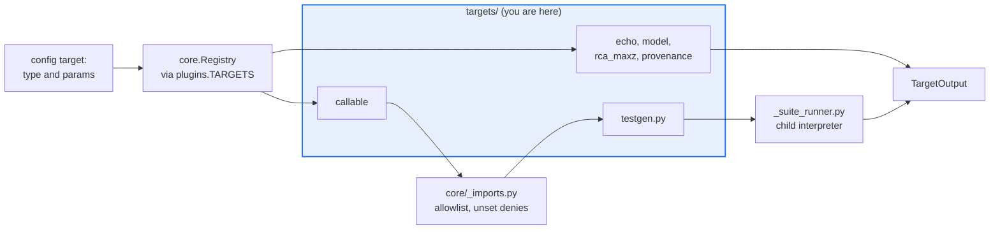

# AGENTS.md — src/eval_harness/targets

> The system-under-test adapters. This is where a config string becomes running code.

A target turns one `EvalItem` into one `TargetOutput`. Two of them execute code named by a
config file, which makes this the highest-privilege directory in the package.

## Map

| Path | Role |
|---|---|
| `__init__.py` | `echo` and `callable` (alias `python`), plus the bottom imports that register the siblings |
| `model.py` | `model` (alias `llm`) — a real OpenAI-compatible, Bedrock or Anthropic endpoint |
| `rca_baseline.py`, `provenance.py` | `rca_maxz`, a deterministic max-absolute-Z diagnosis baseline; `provenance_recorder`, which wraps an inner target and records retrieval evidence |
| `testgen.py` | `run_generated_suite` — a callable target, reached only through the allowlist |
| `testgen_agent.py` | `testgen_agent` — generate a suite from focal plus obligations, then execute it |
| `_sandbox.py`, `_suite_runner.py` | Parent-side environment allowlist and the child interpreter that runs model-authored code |

## Diagram



## Rules that bite here

- **`callable` is deny-by-default.** `params.path` becomes an import and a call, so it must clear `EVAL_HARNESS_CALLABLE_TARGET_ALLOWLIST`; unset means deny. Matching is on dotted module
  boundaries, never a string prefix, and the attribute is checked as well as the module (ADR 0039). Never allowlist `eval_harness` itself.
- **Model-authored code runs only in the child interpreter.** `_suite_runner.py` is executed as a subprocess, never imported; the child inherits an allowlisted environment so generated code
  cannot read the harness's credentials, and its limits travel in that environment rather than through a fork hook that is unsafe under threads.
- **`targets` may import only `core` and `plugins`.** Reaching into `judges` for a client helper adds an undeclared component edge and fails the drift gate; the duplicated
  client-construction lines in `model.py` are deliberate and recorded in ADR 0013.
- **Fail closed, do not raise.** A missing generator, a malformed suite or an out-of-scope split returns structured empty evidence, so the item is visibly failed rather than dropped.
- **A registered name must appear in the README tables**, or `python scripts/extract_registries.py --check` reports drift.

## Verify

```bash
python -m pytest tests/test_callable_target_allowlist.py tests/test_testgen_target.py tests/test_model_target.py -q
```

## Subagents

| Task in this directory | Agent | Why |
|---|---|---|
| Find every site that resolves a config string into an import | `explorer` | Read-only `Grep` for the allowlist helpers shows the complete set in one pass |
| Run the allowlist and sandbox suites after touching either gate | `test-runner` | Has `Bash`; the subprocess boundary only exercises under a real run |
| Review a new target before it ships | `narrow-critic` | A target that widens what config can reach is the highest-risk diff in this package |

## See also

| Doc | Read it when |
|---|---|
| [`../../../docs/decisions/0039-callable-target-allowlist.md`](../../../docs/decisions/0039-callable-target-allowlist.md) | You are changing how a config path is resolved, or wondering why unset denies |
| [`../../../docs/decisions/0045-testgen-sandbox-boundary.md`](../../../docs/decisions/0045-testgen-sandbox-boundary.md) | You are touching `_sandbox.py` or the child runner and need what the boundary guarantees |
| [`../../../docs/decisions/0048-agent-in-the-loop-testgen.md`](../../../docs/decisions/0048-agent-in-the-loop-testgen.md) | You are working on `testgen_agent.py` and need why it is a registry name, not an allowlist entry |
| [`../AGENTS.md`](../AGENTS.md) | You need the harness-wide contract rather than this directory's |
