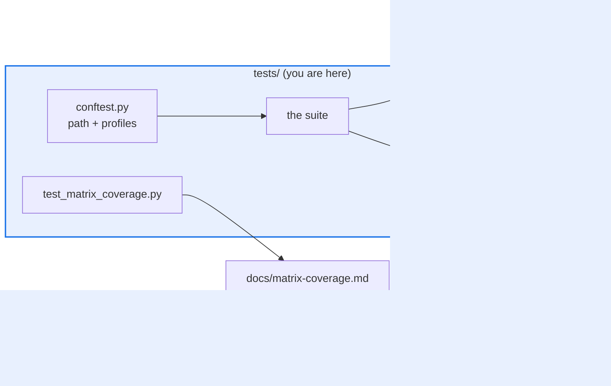

# AGENTS.md — tests

> The root suite. Every file here is a protected path; adding one needs a labeled approval.

This is the harness's own test suite plus the guards that freeze its public surface. It has
no README by design — the suite is not a shipped component. What an agent needs before
touching it is the approval obligation, the coverage floor, and which files here are
contracts rather than tests.

## Map

| Path | Role |
|---|---|
| `conftest.py` | Prepends the sibling package roots onto the path; registers Hypothesis profiles |
| `_*.py` | Helper modules, deliberately not collected by pytest |
| `integration/` | Collected by default; individual tests skip on a missing credential |
| `fixtures/` | Committed test data |
| `public_surface_baseline.json` | Frozen public surface. A diff is a compatibility break |
| `plugin_registry_baseline.json` | Frozen plugin registry, same contract |
| `test_matrix_coverage.py` | Census CLI behind `make matrix-check`; `--update` regenerates the doc |

## Diagram



## Rules that bite here

- **`tests/**` is a protected path.** Any change here, and in particular any new
  `tests/test_*.py`, trips `scripts/check_protected_changes.py` and the pull request needs
  the `eval-change-approved` label plus a code owner. Plan for that before you start; do not
  fold a test into an unrelated file to avoid the guard, which is precisely the evasion the
  guard exists to catch.
- **The floor is 96 and it is pinned.** It is declared in `pyproject.toml` and again in
  `scripts/quality-gate.sh`, and `../coverage-floors.yaml` pins the minimum both may state.
  Lowering it is a reviewed act; raising it is free.
- **The frozen baselines are contracts, not fixtures.** A diff against
  `public_surface_baseline.json` or `plugin_registry_baseline.json` means a public name
  moved. Restore the name or write the deprecation; do not restamp the baseline to go green.
- **A helper module must start with an underscore.** That is how the suite keeps
  `_sut.py`, `_matrix_coverage.py` and the rest out of collection while still importable.
- **Registered components carry a matrix obligation (ADR 0032).** After adding or renaming
  rows in `test_matrix_eval_tools.py`, run `python tests/test_matrix_coverage.py --update`;
  never hand-edit `docs/matrix-coverage.md`. Waivers are data with reasons, not omissions.

## Verify

```bash
./scripts/quality-gate.sh coverage
```

## Subagents

| Task in this directory | Agent | Why |
|---|---|---|
| Locate the existing test for a behaviour before adding a file | `explorer` | Read-only; finding an existing home avoids tripping the protected-path guard at all |
| Run a subset and isolate a failure signature | `test-runner` | Has `Bash`; `maxTurns: 8` fits a run-read-narrow loop over 114 modules |
| Review a baseline change before pushing | `narrow-critic` | A restamped baseline looks like a passing diff and is a silent break |

## See also

| Doc | Read it when |
|---|---|
| [`../scripts/eval_protected_paths.py`](../scripts/eval_protected_paths.py) | You want the authoritative list of what needs the approval label |
| [`../coverage-floors.yaml`](../coverage-floors.yaml) | The coverage floor is blocking you and you are tempted to lower it |
| [`../docs/decisions/0032-matrix-completeness-policy.md`](../docs/decisions/0032-matrix-completeness-policy.md) | You registered a component and need to know what rows it now owes |
| [`../docs/e2e-runbook.md`](../docs/e2e-runbook.md) | You are running or reading the whole-repo end-to-end harness rather than this suite |
| [`../AGENTS.md`](../AGENTS.md) | You need the repo-wide testing conventions, markers and offline-dependency idiom |
